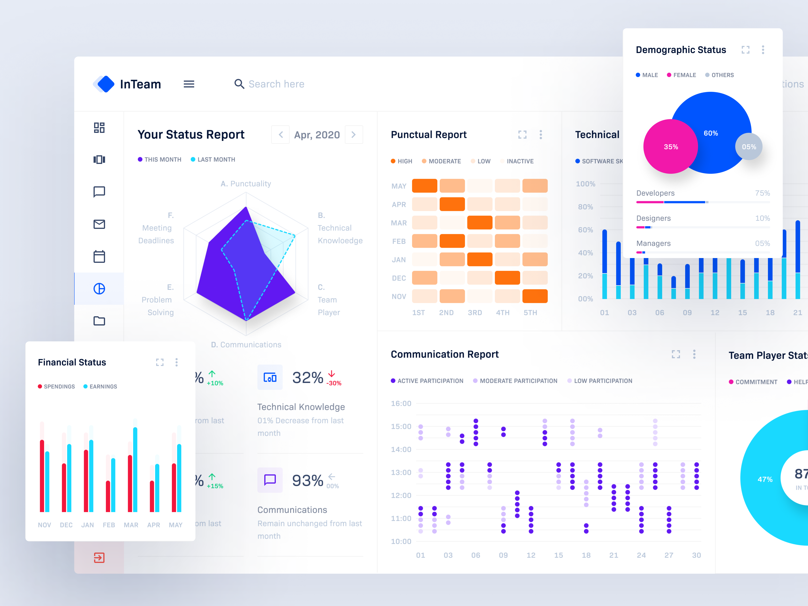
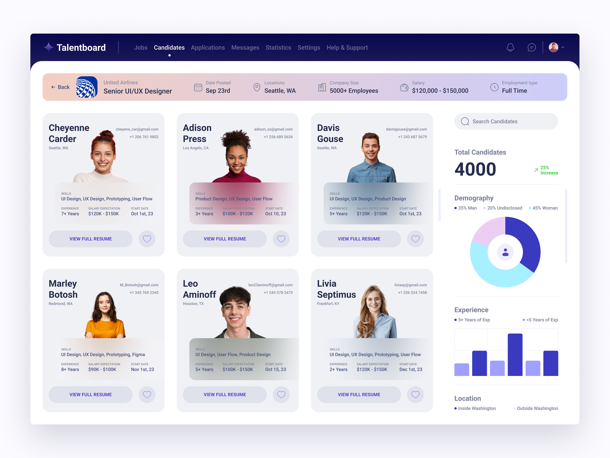

  

Welcome to my GitHub profile! I'm Gulam Sulaman Choudhury, a passionate 29-year-old graduate student navigating the dynamic realm of Computer and Information Science at Western Washington University. Based in the vibrant tech hub of Redmond, Washington, I not only thrive in the world of academia but also find joy in exploring scenic routes on my bike, immersing myself in captivating movies, harmonizing with diverse music genres, and cherishing moments with friends.
  

---

## 💻 Researcher, Design & Developer

  

As a researcher, designer, and developer, I bring a multidimensional approach to the intersection of technology and human experience. My academic journey is marked by a keen interest in Behavioral Computation Research and Human-Computer Interaction Research. Delving into the intricate patterns of human behavior and the evolving landscape of technology interaction fuels my intellectual curiosity.
  

---

## 🚀 Programming & Technical Skills

| Category                    | Skills                                              |
|-----------------------------|-----------------------------------------------------|
| Programming Language        | R, Python, C++, Javascript, PHP                     |
| Software Skills             | Figma, Photoshop, Illustrator, After Effect, Blender, VS Code, Anaconda, Jupiter, Tensorflow |
| Web & Mobile Development    | HTML, CSS, Bootstrap, React, MongoDB, Firebase, Flutter |

---

## 📚 Education

| University | Year | Degree                               |
|------------|------|--------------------------------------|
| Western Washington University, USA | 2025 | M.Sc. (Computer Science)   |
| Leading University, Bangladesh | 2021 | B.Sc. (Computer Science & Engineering) |

---

## 📄 Resume

  

I am passionate about my field and actively seeking opportunities for a research internship, UI/UX design internship, or frontend development internship. If you have a fitting opportunity, I would love to connect and contribute to innovative projects.
  

<a href="https://drive.google.com/file/d/1aPjQ8Ieb69CAFDBq9q2kJx-vqepXe9b6/view?usp=sharing" target="_blank" style="text-decoration: none;">
  <button style="width: 200px; padding: 15px; background-color: #0B5257; color: #FFFFFF; border: none; border-radius: 5px; cursor: pointer; text-transform: uppercase; font-weight: bold;">
    View My Resume
  </button>
</a>

---

## 🔬 Research Experience

### Undergraduate Research (September 2021 - December 2021)
- **Thesis Title:** A Multi-Classification Deep Learning Model For Diagnosing Different Chest Diseases.
- **Responsibilities:** Background Study, Model Testing & Fixing, Report Analysis & Writing
- **Reference:** Adil Ahmed Chowdhury, Lecturer, Leading University, Sylhet, [adil@lus.ac.bd](mailto:adil@lus.ac.bd)

---

## 📋 Work Experiences

### UI/UX Designer
**Datacube.ai | Los Angeles, California, USA**
- Played a crucial role in designing user interfaces for data visualization and analytics software.
- Collaborated with cross-functional teams to create intuitive and visually appealing user experiences.
- Utilized Figma and Adobe Creative Cloud tools to craft UI elements that enhanced product usability.
- Contributed to improving user engagement and satisfaction.
- Maintained good communication, delivered fast service, and resolved complex issues.

### Art Director
**Leading University Computer Club & Orpheus | Leading University, Sylhet**
- Led design efforts for various club programs and events.
- Designed merchandise and promotional materials to enhance the club's visibility and impact.
- Worked closely with team members to create cohesive branding strategies.

---
## 🛠️ Projects

  <!-- Project One -->
  

    
    
InTeam Management Dashboard

    
Inteam is a conceptual team management Dashboard designed to increase overall team performance while keeping everything in the same platform.

    
<a href="https://dribbble.com/shots/14509792-Status-Report-InTeam-Team-Management-Dashboard" target="_blank">Visit Project</a>

  

  <!-- Project Two -->
  

    
    
Talentboard - Candidates

    
Talentboard is a conceptual online platform or interface where job seekers can manage and track various aspects of their job search process.

    
<a href="https://dribbble.com/shots/22644733-Talentboard-Candidates" target="_blank">Visit Project Two</a>

  

---

## 📋 Extracurricular Activities

- **President (2021-2022)**: Leading University Computer Club, Leading University, Sylhet.
- **Vice President (2021-2022)**: Orpheus “Bolt From The Rock” - A Musical Club, Leading University, Sylhet.
- **IT Manager (2021-2022)**: Leading University Social Services Club, Leading University, Sylhet.

---

## 📧 Contact Information

<!-- Email -->
<a href="mailto:gulamsulaman@gmail.com" target="_blank" style="text-decoration: none;">
  <button style="padding: 15px; background-color: #0B5257; color: #FFFFFF; border: none; border-radius: 5px; cursor: pointer; text-transform: uppercase; font-weight: bold;">
    Email Me
  </button>
</a>

<!-- LinkedIn -->
<a href="http://www.linkedin.com/in/abirsulaman" target="_blank" style="text-decoration: none;">
  <button style="padding: 15px; background-color: #2867B2; color: #FFFFFF; border: none; border-radius: 5px; cursor: pointer; text-transform: uppercase; font-weight: bold;">
    LinkedIn
  </button>
</a>

<!-- GitHub -->
<a href="https://github.com/gulamchy" target="_blank" style="text-decoration: none;">
  <button style="padding: 15px; background-color: #333333; color: #FFFFFF; border: none; border-radius: 5px; cursor: pointer; text-transform: uppercase; font-weight: bold;">
    GitHub
  </button>
</a>

<!-- Twitter -->
<a href="https://twitter.com/AbirSulaman" target="_blank" style="text-decoration: none;">
  <button style="padding: 15px; background-color: #1DA1F2; color: #FFFFFF; border: none; border-radius: 5px; cursor: pointer; text-transform: uppercase; font-weight: bold;">
    Twitter
  </button>
</a>

